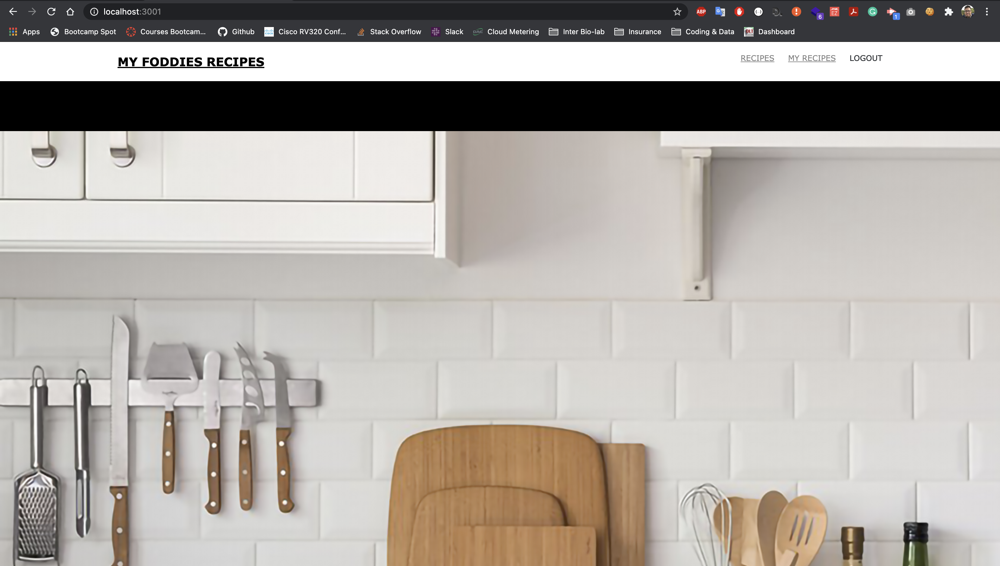
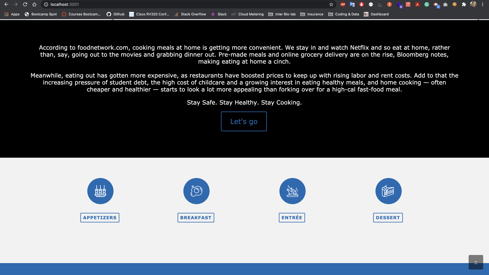
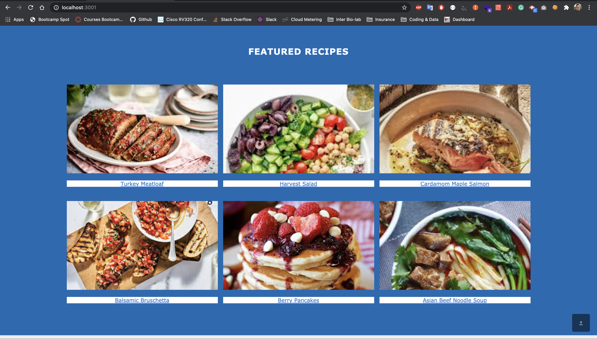
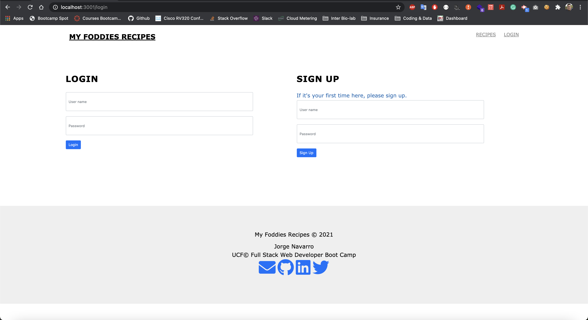
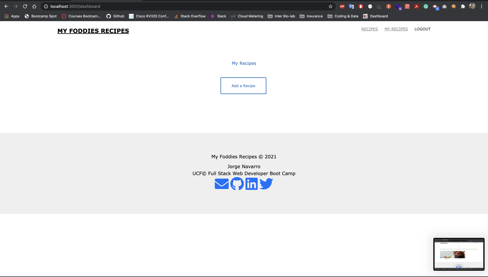
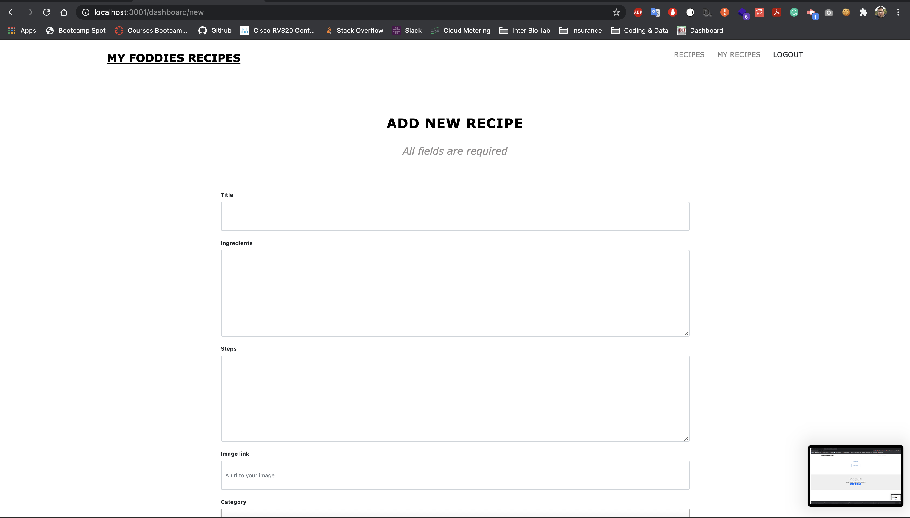

# my-foodie-recipes
Full Stack Project

## Table of Contents

* [Description](#Description)
* [Requirements](#Requirements)
* [Installation](#Installation)
* [Usage](#Usage)
* [License](#License)
* [Badges](#Badges)
* [Issues](#Issues)
* [Technologies](#Technologies)
* [Screenshot](#screenshot)
* [Deployment](#deployment)
* [Contributing](#Contributing)
</br>
</br>

## Description
This application was built to allow users to find new recipes and share their own recipes. On the homepage of the site, the user have the ability to view all recipes or view recipes by categories. If the user want to share their own recipes or to comment on existing recipes, user can sign up for a user account. Once signed up, they will have access to their own dashboard which only shows their own added recipes. From the dashboard, user can update or edit existing recipes and add new recipes. When clicking on any recipe, they will get more information including ingredients, recipe steps and all comments.
<br>
<br>

## Requirements
#### User Story
>Are you cooking at home more than you used to and eating out at fast-food restaurants less? If so, you are right on trend.
<br>

>>Today, 82 percent of the meals Americans eat are prepared at home, a much higher percentage than a decade ago, according to research from NPD Group Inc. cited by Bloomberg. At the same time, restaurant dining has declined. The average American ate out about 185 times last year, whereas in 2000 they ate out about 216 times a year, NPD reported. In fact, in 2018, the total number of restaurant visits per person hit its lowest point in 28 years, according to Bloomberg.<br>

>>So what’s driving the eat-at-home trend? A bunch of things, probably. But a lot of it may be that the money-versus-convenience ratio is changing.<br>

>>Cooking meals at home is getting more convenient. We stay in and watch Netflix and so eat at home, rather than, say, going out to the movies and grabbing dinner out. Pre-made meals and online grocery delivery are on the rise, Bloomberg notes, making eating at home a cinch.Meanwhile, eating out has gotten more expensive, as restaurants have boosted prices to keep up with rising labor and rent costs. Add to that the increasing pressure of student debt, the high cost of childcare and a growing interest in eating healthy meals, and home cooking — often cheaper and healthier — starts to look a lot more appealing than forking over for a high-cal fast-food meal.<br>
<br>

## Installation
To use this application, please install: 
```
npm install
npm install mysql2
npm install sequelize
npm install express 
npm install express-handlebars 
npm install express-session 
npm install bcrypt 
npm install connect-session-sequelize
```

<br/>
<br/>

## Usage
After cloning the repo and installing the required npm packages, use the command line to navigate to the root of the application and from the project root folder enter the sql shell and run the following command: 
```
source db/schema.sql
```
Exit the sql shell and Run the following commands:
```
npm run seed
npm start
```

<br/>
<br/>

## License 
[](https://opensource.org/licenses/MIT)
</br>
</br>

## Badges


</br>
</br>

## Issues
[](https://GitHub.com/jorgeebn16/my-foodie-recipes/issues/)
[](https://GitHub.com/jorgeebn16/my-foodie-recipes/issues?q=is%3Aissue+is%3Aclosed)
</br>
</br>

## Technologies
* [Node](https://nodejs.org/en/)
* [Express](https://expressjs.com/)
* [Express Sessions](https://www.npmjs.com/package/express-session)
* [Bcrypt](https://www.npmjs.com/package/bcryptjs)
* [Handlebars](https://www.npmjs.com/package/handlebars)
* [Javascript](https://developer.mozilla.org/en-US/docs/Web/JavaScript)
* [jQuery](https://jquery.com/)
* [npm](https://www.npmjs.com/)
* [mysql2](https://www.npmjs.com/package/mysql2)
* [sequelize](https://sequelize.org/)
* [JawsDB](https://www.jawsdb.com/)
* [Sass](https://sass-lang.com/)
* [icomoon](https://icomoon.io/)
* [Animate](https://animate.style/)
* [Animate](https://getbootstrap.com/)


<br/>
<br/>

## Screenshot








</br>
</br>

## Deployment
View [Heroku App](https://my-foodie-recipes.herokuapp.com/)

## Contributing
[](https://GitHub.com/Naereen/jorgeebn16/my-foodie-recipes/graphs/contributors/)

For anyone who wishes to contribute you can contact me with at jorgeebn16@gmail.com
</br>
</br>

Would you like to reach me?
</br>
Contact Me:

Github: https://github.com/jorgeebn16</br>
Email: jorgeebn16@gmail.com


## Issues
[](https://GitHub.com/jorgeebn16/my-foodie-recipes/issues/)
[](https://GitHub.com/jorgeebn16/my-foodie-recipes/issues?q=is%3Aissue+is%3Aclosed)


